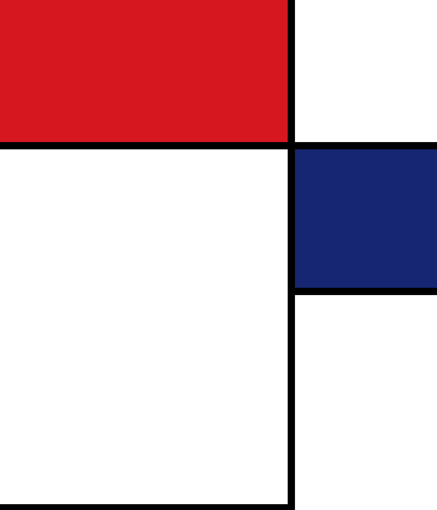
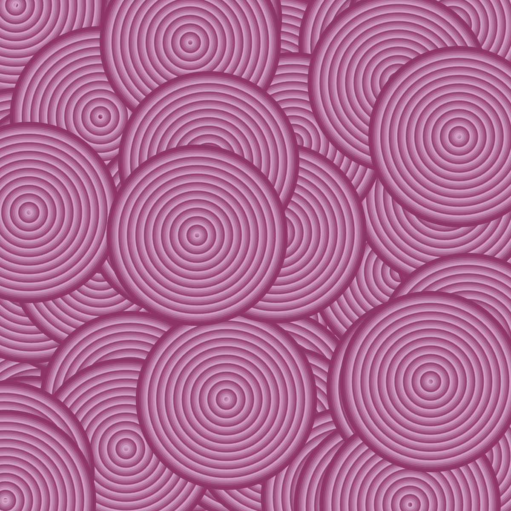
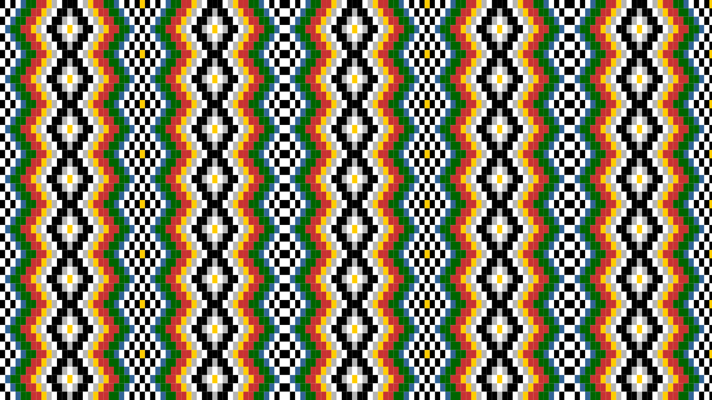

# Genuary 2025

## 🌄 Gallery 🌄
<table>
  <tr>
    <td align="center">
      <a href="https://github.com/surbhi-bh/genuary2025/blob/main/genuary_01/genuary_01_lines.png">
        
         JAN. 1: Vertical or horizontal lines only
      </a>
    </td>
    <td align="center">
      <a href="https://github.com/surbhi-bh/genuary2025/blob/main/genuary_02/genuary_02_layers.png">
        
         JAN. 2: Layers upon layers upon layers
      </a>
    </td>
    <td align="center">
      <a href="#">
        
         JAN. 3: Exactly 42 lines of code
      </a>
    </td>
  </tr>
  <tr>
    <td align="center">
      <a href="#">
        
         JAN. 4: Black on black
      </a>
    </td>
    <td align="center">
      <a href="#">
        
         JAN. 5: Isometric Art (No vanishing points)
      </a>
    </td>
    <td align="center">
      <a href="#">
        
         JAN. 6: Make a landscape using only primitive shapes
      </a>
    </td>
  </tr>
  <tr>
    <td align="center">
      <a href="#">
        
         JAN. 7: Use software that is not intended to create art or images
      </a>
    </td>
    <td align="center">
      <a href="#">
        
         JAN. 8: Draw one million of something
      </a>
    </td>
    <td align="center">
      <a href="#">
        
         JAN. 9: The textile design patterns of public transport seating
      </a>
    </td>
  </tr>
  <tr>
    <td align="center">
      <a href="#">
        
         JAN. 10: You can only use TAU in your code, no other number allowed
      </a>
    </td>
    <td align="center">
      <a href="#">
        
         JAN. 11: Impossible day
      </a>
    </td>
    <td align="center">
      <a href="#">
        
         JAN. 12: Subdivision
      </a>
    </td>
  </tr>
  <tr>
    <td align="center">
      <a href="#">
        
         JAN. 13: Triangles and nothing else
      </a>
    </td>
    <td align="center">
      <a href="#">
        
         JAN. 14: Pure black and white. No gray
      </a>
    </td>
    <td align="center">
      <a href="genuary_15/genuary_15_rug.png">
        
         JAN. 15: Design a rug
      </a>
    </td>
  </tr>
  <tr>
    <td align="center">
      <a href="#">
        
         JAN. 16: Generative palette
      </a>
    </td>
    <td align="center">
      <a href="#">
        
         JAN. 17: What happens if pi=4?
      </a>
    </td>
    <td align="center">
      <a href="#">
        
         JAN. 18: What does wind look like
      </a>
    </td>
  </tr>
  <tr>
    <td align="center">
      <a href="#">
        
         JAN. 19: Op Art
      </a>
    </td>
    <td align="center">
      <a href="#">
        
         JAN. 20: Generative Architecture
      </a>
    </td>
    <td align="center">
      <a href="#">
        
         JAN. 21: Create a collision detection system
      </a>
    </td>
  </tr>
  <tr>
    <td align="center">
      <a href="#">
        
         JAN. 22: Gradients only
      </a>
    </td>
    <td align="center">
      <a href="#">
        
         JAN. 23: Inspired by Brutalism
      </a>
    </td>
    <td align="center">
      <a href="#">
        
         JAN. 24: Geometric art - pick either a circle, rectangle, or triangle and use only that geometric shape
      </a>
    </td>
  </tr>
  <tr>
    <td align="center">
      <a href="#">
        
         JAN. 25: One line that may or may not intersect itself
      </a>
    </td>
    <td align="center">
      <a href="#">
        
         JAN. 26: Symmetry
      </a>
    </td>
    <td align="center">
      <a href="#">
        
         JAN. 27: Make something interesting with no randomness or noise or trig
      </a>
    </td>
  </tr>
  <tr>
    <td align="center">
      <a href="#">
        
         JAN. 28: Infinite Scroll
      </a>
    </td>
    <td align="center">
      <a href="#">
        
         JAN. 29: Grid-based graphic design
      </a>
    </td>
    <td align="center">
      <a href="#">
        
         JAN. 30: Abstract map
      </a>
    </td>
  </tr>
  <tr>
    <td align="center">
      <a href="#">
        
         JAN. 31: Pixel sorting
      </a>
    </td>
  </tr>
</table>
