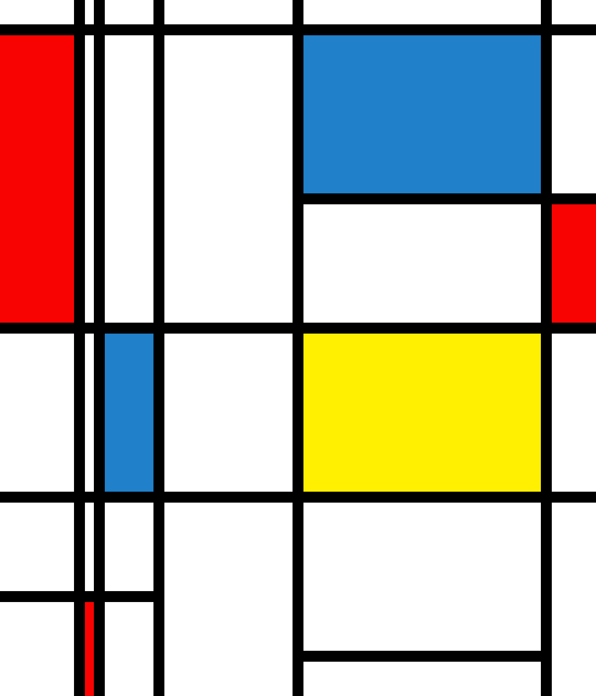

# Genuary 2025

## 🌄 Gallery 🌄
<table> 
  <tr> 
    <td align="center"> 
      <a href="https://editor.p5js.org/surbhibhatia/sketches/I5gQ2wQKP"> 
         
         JAN. 1: Vertical or horizontal lines only 
      </a> 
    </td> 
    <td align="center"> 
      <a href="#"> 
         
         JAN. 2: Layers upon layers upon layers 
      </a> 
    </td> 
    <td align="center"> 
      <a href="#"> 
         
         JAN. 3: Exactly 42 lines of code 
      </a> 
    </td> 
  </tr> 
  <tr> 
    <td align="center"> 
      <a href="#"> 
         
         JAN. 4: Black on black 
      </a> 
    </td> 
    <td align="center"> 
      <a href="#"> 
         
         JAN. 5: Isometric Art 
      </a> 
    </td> 
    <td align="center"> 
      <a href="#"> 
         
         JAN. 6: Primitive Shapes Landscape 
      </a> 
    </td> 
  </tr> 
  <tr> 
    <td align="center"> 
      <a href="#"> 
         
         JAN. 7: Non art software 
      </a> 
    </td> 
    <td align="center"> 
      <a href="#"> 
         
         JAN. 8: Draw one million of something 
      </a> 
    </td> 
    <td align="center"> 
      <a href="#"> 
         
         JAN. 9: The textile design patterns of public transport seating 
      </a> 
    </td> 
  </tr> 
  <tr> 
    <td align="center"> 
      <a href="#"> 
         
         JAN. 10: You can only use TAU in your code 
      </a> 
    </td> 
    <td align="center"> 
      <a href="#"> 
         
         JAN. 11: Impossible day 
      </a> 
    </td> 
    <td align="center"> 
      <a href="#"> 
         
         JAN. 12: Subdivision 
      </a> 
    </td> 
  </tr> 
  <tr> 
    <td align="center"> 
      <a href="#"> 
         
         JAN. 13: Triangles and nothing else 
      </a> 
    </td> 
    <td align="center"> 
      <a href="#"> 
         
         JAN. 14: Pure black and white. No gray 
      </a> 
    </td> 
    <td align="center"> 
      <a href="#"> 
         
         JAN. 15: Design a rug 
      </a> 
    </td> 
  </tr> 
  <tr> 
    <td align="center"> 
      <a href="#"> 
         
         JAN. 16: Generative palette 
      </a> 
    </td> 
    <td align="center"> 
      <a href="#"> 
         
         JAN. 17: What happens if pi=4? 
      </a> 
    </td> 
    <td align="center"> 
      <a href="#"> 
         
         JAN. 18: What does wind look like 
      </a> 
    </td> 
  </tr> 
  <tr> 
    <td align="center"> 
      <a href="#"> 
         
         JAN. 19: Op Art 
      </a> 
    </td> 
    <td align="center"> 
      <a href="#"> 
         
         JAN. 20: Generative Architecture 
      </a> 
    </td> 
    <td align="center"> 
      <a href="#"> 
         
         JAN. 21: Create a collision detection system 
      </a> 
    </td> 
  </tr> 
  <tr> 
    <td align="center"> 
      <a href="#"> 
         
         JAN. 22: Gradients only 
      </a> 
    </td> 
    <td align="center"> 
      <a href="#"> 
         
         JAN. 23: Inspired by Brutalism 
      </a> 
    </td> 
    <td align="center"> 
      <a href="#"> 
         
         JAN. 24: Geometric art 
      </a> 
    </td> 
  </tr> 
  <tr> 
    <td align="center"> 
      <a href="#"> 
         
         JAN. 25: One line that may or may not intersect itself 
      </a> 
    </td> 
    <td align="center"> 
      <a href="#"> 
         
         JAN. 26: Isometric Art 2 
      </a> 
    </td> 
    <td align="center"> 
      <a href="#"> 
         
         JAN. 27: Earth 2 
      </a> 
    </td> 
  </tr> 
  <tr> 
    <td align="center"> 
      <a href="#"> 
         
         JAN. 28: Reflection 
      </a> 
    </td> 
    <td align="center"> 
      <a href="#"> 
         
         JAN. 29: Rainbow 
      </a> 
    </td> 
    <td align="center"> 
      <a href="#"> 
         
         JAN. 30: Stealth 
      </a> 
    </td> 
  </tr> 
</table>
